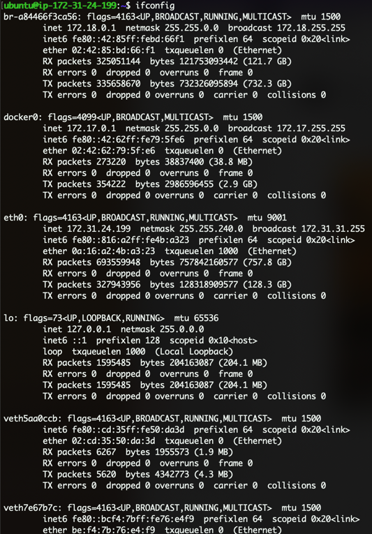

# Poolsea submit rewards guide
> The first generation of the tree is the most difficult.  
Make sure that your protocol has at least 2 minipools of 16 million PLS transferred to staking status and user stakes that overlap the created 16 + 16 million PLS minipools.  
For start getting rewards in PLS, protocol should have minimum 1 node which joined to *smoothing pool*

## Step by step

---
> <b>Networks:</b>  
> `pulse` is Pulsechain mainnet network  
> `pulseTest` is Pulsechain testnet network

1) ### Connect to your machine
   > Machine should have:
   > - started `smartnode` containers
   > - synced *Execution client* and *Beacon client*

    > If it you local machine, nothing to do.

    If it virtual machine:  
    #### Connection example with **ssh key**:  
    For example, we have ssh key with name `RDNodes.pem`  
    Go to folder which consist key file and run next line:
    ```shell
    chmod 400 RDNodes.pem
    ```
    ```shell
    ssh -i "RDNodes.pem" ubuntu@ec2-50-19-143-245.compute-1.amazonaws.com
    ```
   
2) ### Clone `treegen` repository
    > You need to do it, only if machine haven't this repository or repository updated on GitHub
    - Go to `/usr/local/go/src/github.com/rocket-pool` folder
    - Clone repository from GitHub:
    ```shell
    git clone https://github.com/PoolSea-Staking-Pool/treegen.git
    ```
    - Go to repository folder: `cd treegen`

3) ### Find out the IP address of your machine, and your synced clients
    Run command: `ifconfig`
    You'll get something like that:
    
    
    - #### You have `docker` title in list:
       You should get `inet` value from there.  
       For example: `172.17.0.1` according to screenshot upper.

   - #### You haven't `docker` title in list:
      You should get `inet` value from first item in list.  
      For example: `172.18.0.1` according to screenshot upper.

4) ### Start docker
    Run command:   
    ```shell
    service docker start
    ```

5) ### Generate rewards tree
    > IP_ADDRESS - ip address from 3 topic  
   > Execution client have been launched on `8545` port  
   > Beacon client have been launched on `5052` port  

    Run tree generation using next line:
    ```shell
    ./treegen.sh -b http://<IP_ADDRESS>:5052 -e http://<IP_ADDRESS>:8545
    ```
    
    Example of successfully finished generation:
    
    
    Result of generation file consists from next:   
    `rp-rewards-<NETWORK_NAME>-<INTERVAL_ID>.json`  
    For example: `rp-rewards-pulsechain-testnet-v4-0.json`  
    - `NETWORK_NAME` - *pulsechain-testnet-v4*
    - `INTERVAL_ID` - *0*

6) ### Push rewards file to `rewards-trees` repository
   1) Back from `treegen` folder: `cd ..`
   2) Clone `rewards-trees` repository: `git clone https://github.com/PoolSea-Staking-Pool/rewards-trees.git`
   3) Go to `treegen/out` folder where locate tree file: `cd treegen/out`
   4) Copy file to `rewards-trees` repository folder: `cp rp-rewards-<NETWORK_NAME>-<INTERVAL_ID>.json ../rewards-trees/<NETWORK_NAME>/`
   5) Add, commit and push file: `git add * && git commit -m "<INTERVAL_ID> interval tree" && git push`
   > If you unauthenticated on GitHub, please generate git ssh key and add to GitHub account  
   > Here guide: [ssh generate and add to GitHub](https://docs.github.com/en/github-ae@latest/authentication/connecting-to-github-with-ssh/adding-a-new-ssh-key-to-your-github-account)

7) ### Execute rewards using script
    - #### Install project dependencies:
       ```shell
       npm install
       ```
    - #### Configure `.env` file:
      Rename `.env.example` to `.env` and change mocks to your data.  
      For example:  
      `ROCKET_STORAGE=<address>`  
      to  
      `ROCKET_STORAGE=0x00000000000000000000000000000000`

      **Variables which need:**  
      `NODE_WALLET_PRIVATE_KEY` - private key for node wallet which registered in protocol   
      `ROCKET_STORAGE` - deployed poolsea storage contract
      `REWARDS_REPO_URL` - repository with pushed rewards tree file. By default: `https://github.com/PoolSea-Staking-Pool/rewards-trees/raw/main/`

    - #### Change tx sender from mnemonic to private key
       Go to hardhat config and do next for your network:  
       Before:
       ```
      pulse: {
               url: 'https://rpc.pulsechain.com',
               accounts: {
                   mnemonic: mnemonicPhrase,
                   path: 'm/44\'/60\'/0\'/0',
                   initialIndex: 0,
                   count: 1,
                   passphrase: mnemonicPassword,
               },
               // accounts: [nodeWalletPrivateKey],
           },
      ```
       After:
       ```
      pulse: {
               url: 'https://rpc.pulsechain.com',
               // accounts: {
               //     mnemonic: mnemonicPhrase,
               //     path: 'm/44\'/60\'/0\'/0',
               //     initialIndex: 0,
               //     count: 1,
               //     passphrase: mnemonicPassword,
               // },
               accounts: [nodeWalletPrivateKey],
           },
      ```
    
    - #### Replace all in `rewards-gen-file.json` to contents from your rewards tree generated file
    - #### Start rewards submitting
      Run next command:
      ```shell
      npm hardhat run ./scripts/execute-rewards-from-json-tree.js --network <network>
      ```
